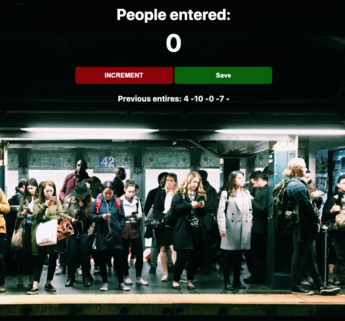
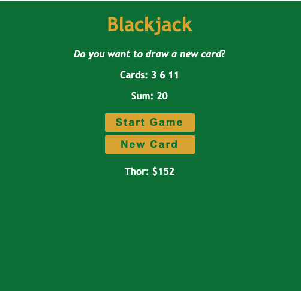
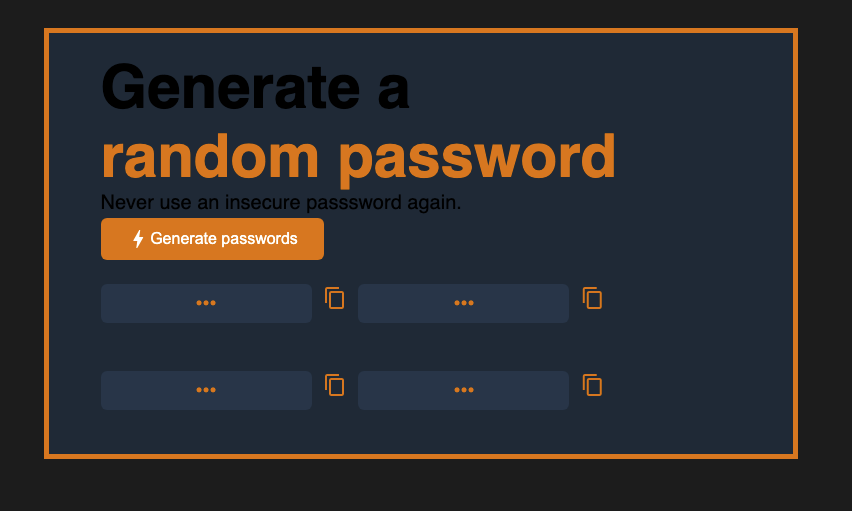

#  JavaScript Apps
Projects from [Learn JavaScript](https://scrimba.com/learn/learnjavascript) course from [Scrimba](https://scrimba.com)

## Table of Contents
[Introduction](#Introduction)

[Motivation](#Motivation)

[Built With](#built-with)

[License](#License)

[Acknowledgements](#Acknowledgements)

## Introduction
Welcome to my projects from the Learn JavaScript course from Scrimba.The course provided coding challenges along with projects. It focused on using the concepts taught in the course to building web applications.

## Projects

### Counter App

The first project from the course was to build a counter app. Starting the count at 0 a button click increments the counter by 1. The user also has the option to save the total and display it in the webpage by clicking on the save button. It also resets the counter to zero, and the user can save multiple totals.

### Black Jack Game

This project was to build a web application that has the functionality of a black jack game. On a button click the user can start a game, and add another card by clicking on the “add card” button. The value of the card is returned, displayed in the webpage, and is added to the total. If the user continues to add cards each value is added to the total. When the user’s score is exactly 21 the app dispayes “you won,” if the user goes over 21 the app display “lost,” and the user can begin a new game at any time

### Password Generator

For this project I built a web application that creates random passwords. On a button click the user can create 4 different random passwords. It also has functionality to copy each password by clicking the copy button. 

### Invoice Creator

Built an invoice creator with JavaScript. The user can choose between the services to add a service to the invoice with a button click. The user can add the date the service was delivered on the invoice. The cost of each service is added and returned as the total. There is an area at the bottom for the user to add any notes about the services and/or service delivery.

### Measurement Convertor

This web application converts between metric and imperial units. The first part of the project was to create a measurement convertor with the value declared in the JavaScript code. The second part of the project was to create a convertor that takes user input and converts that value, and can change based on user input.

## Motivation
I completed this course as a way to build my Javascript skills. I chose this course because it focused on using the skills taught to build projects. 

## Built With
- HTML
- CSS
- JS

## License
[MIT](https://choosealicense.com/licenses/mit/)

## Acknowledgements
[Scrimba](https://scrimba.com/) for putting out the [Learn JavaScript](https://scrimba.com/learn/learnjavascript) course
